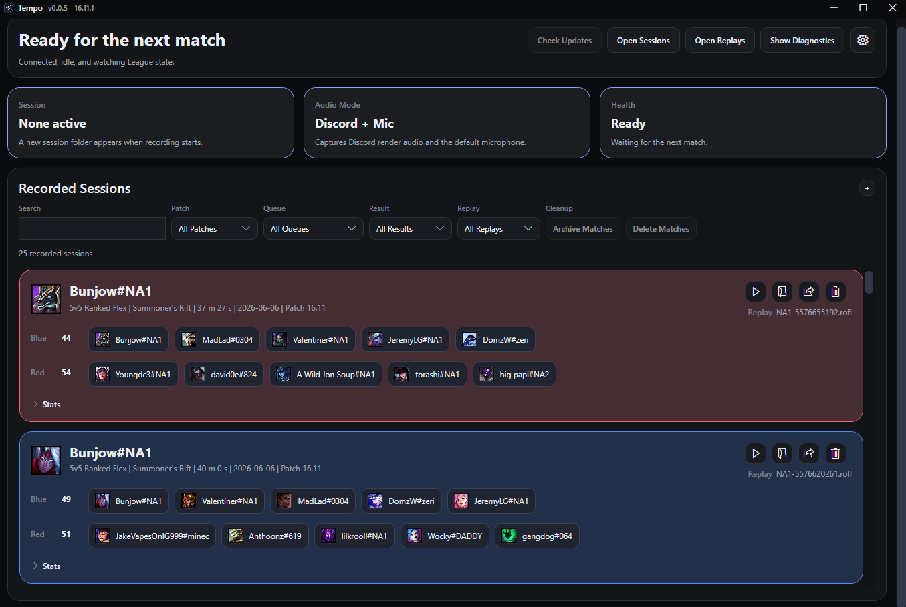
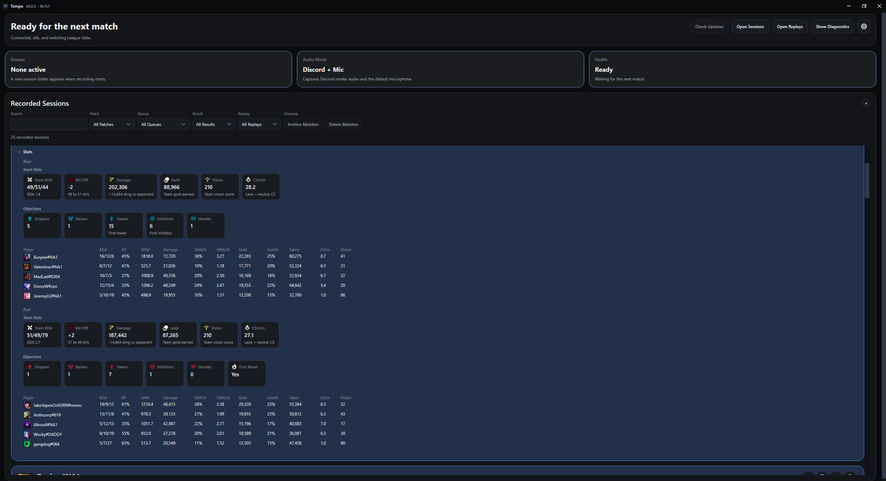
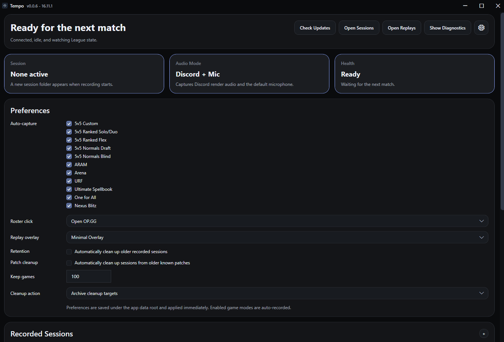

# Tempo

Tempo is a review tool for League of Legends that automatically records team audio and syncs it with game replays.

## What Tempo Does

- Automatically records team comms while you play.
- Syncs recorded comms with game replays for post-game review.
- Keeps a session library for browsing past games, opening replays, and revisiting key moments.
- Adds team-focused match stats that are useful for coordinated play, including objective control, damage share, gold share, kill participation, and vision.

## Who It Is For

Tempo is built for groups that want to improve as a team, especially in:

- Tournaments
- Clash
- Ranked Flex 5v5

The goal is to make post-game review easier when you care about both the in-game replay and what your team was saying at the time.

## How It Works

Tempo watches for supported League of Legends games, records the selected team audio sources, and links the recording to the matching replay after the game ends. From the dashboard you can open a session, launch the replay, and review the game with audio controls that stay synced to replay playback.

The session library is built for repeated review. You can search, filter by patch or queue, keep only recent games, and archive or delete old sessions when they are no longer useful.

## Useful Review Features

- Expand a recorded session to compare team stats, objective counts, and player-level performance.
- Click a Blue or Red team label to open a multi-search for that roster.
- Click an individual player nametag to open their OP.GG profile.
- Use the replay overlay to control synced audio and mark up plays without covering the replay.
- Choose which queues are auto-recorded, how roster clicks behave, and how old sessions should be cleaned up.

## Screenshots

### Dashboard

### Session Stats

### Replay Review

### Settings

## Notes

Tempo is still early, but the main product flow is in place:

- capture team audio automatically
- connect it to the right replay
- review important moments with the comms preserved
- keep sessions organized match after match
